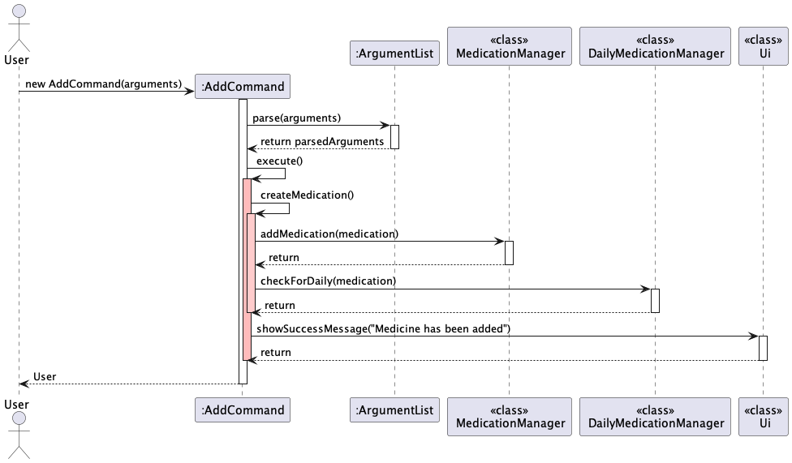
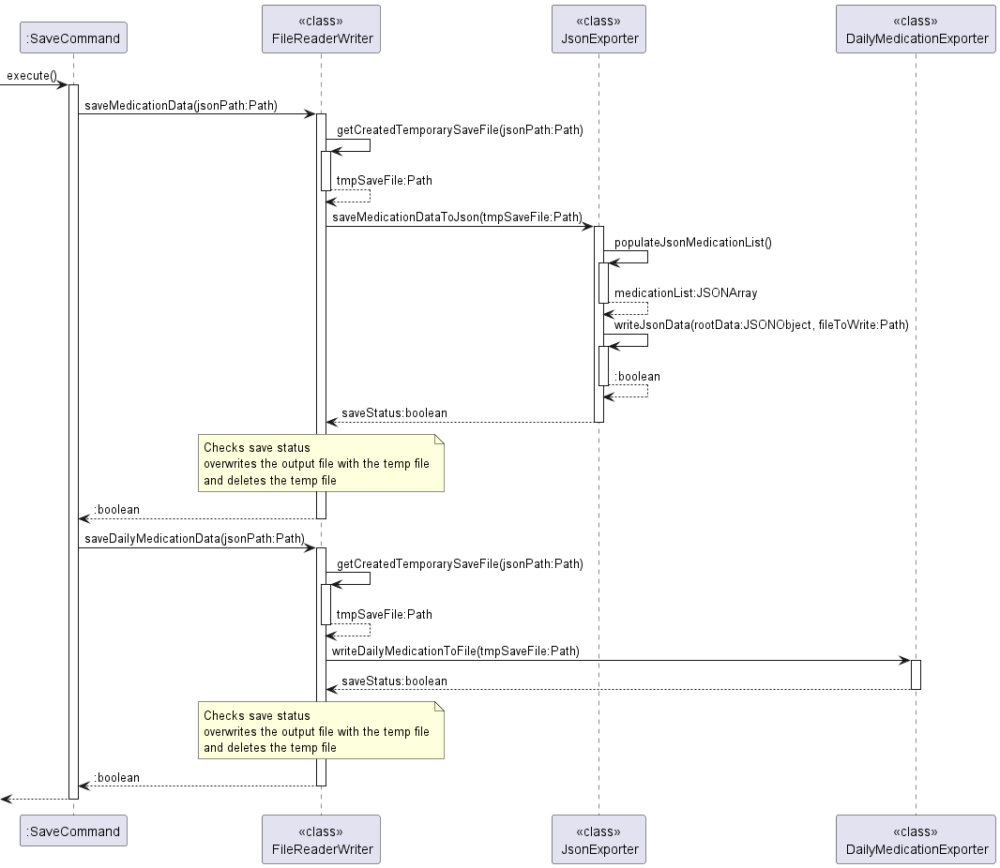
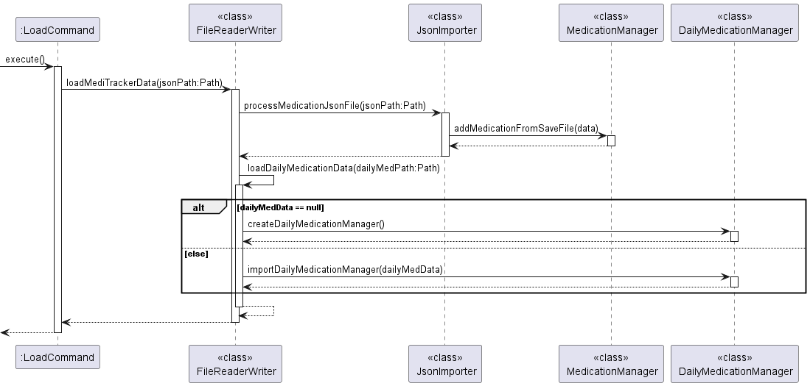

# MediTracker Developer Guide

## Acknowledgements
Ideas and structure for our Developer Guide: 
- [AddressBook 3](https://se-education.org/addressbook-level3/DeveloperGuide.html)

Ideas and structure for the User Guide: 
- [AddressBook 3](https://se-education.org/addressbook-level3/UserGuide.html)
- [Previous Team's User Guide](https://ay2223s1-cs2103t-w16-2.github.io/tp/UserGuide.html) for more styling inspiration and adaptation

Additional Packages used: 
- [JSON](https://github.com/stleary/JSON-java)
- GitHub's built-in Jekyll integration to allow us to render the documentation in a slightly different style.

# Overview
<!-- Add a TOC -->

# Setting up and getting started


# Design & implementation
<!-- Describe the design and implementation of the product. Use UML diagrams and short code snippets where applicable. -->

<!-- Comment: Perhaps add sequence diagram or class diagram here to show the interactions and relationships since this seems to involve quite a lot of classes? -->
## Add Medication Command
The add medication command extends from the Command parent class and implements the following operations:
- execute(MedicationManager, DailyMedicationManager, Ui) - Adds the medication object into the respective medication managers.
- setMedicineAttributes() - Sets the medicine object's attributes to be added to the medicine managers. 
- assertionTest(MedicationManager, DailyMedicationManager) - Asserts that medicine has been added to both medication managers.
- parseStringToValues(Arguments) - Parses string input for medicine quantity and dosage into double type.

Given below is an example usage scenario, along with the sequence diagram and how the add command behaves at each step:


- Step 1. User initiates the process.
- Step 2. `AddCommand` constructs an instance using the constructor `AddCommand(String arguments)` which includes 
parsing the arguments.
- Step 3. `ArgumentList` parses the provided arguments.
- Step 4. `AddCommand` calls `execute()` to add the medication.
- Step 5. Inside `execute()`, AddCommand calls `createMedication()` to construct a `Medication` object.
- Step 6. Adds the newly created `Medication` object to `MedicationManager`.
- Step 7. Checks and updates daily medication records in `DailyMedicationManager`.
- Step 8. `Ui` displays success or error messages to the user.

---
<!-- Comment: Use backticks (`) to encapsulate code rather than using a single quote (') to make it more readable. -->
## List Medication Command
The list medication command extends from Command parent class and contains the following methods:
- execute(MedicationManager medicationManager) - Executes the list command and performs its specific task, -t.
```Where the task can be either 'list -t all' to list all medications or 'list -t today' to list medications for the day, which is divided into three categories -> Morning, Afternoon and Evening. ```
<!-- Comment: Consider only highlighting the code part rather than the whole sentence. -->
<!-- Comment: Perhaps specify that the following parameters need to follow the "list -t" command instead of preceding it or some other order? -->
**The 'list -t' command requires the following:**
- 'all' - to run printAllMedications() from the MedicationManager.

**The following commands print medications to be taken in a day:**
<!--Comment: Perhaps clarify what is the difference between inputting "today -m", "today -a" and "today -e"? -->
1. 'today' - to run printMedications() from the DailyMedicationManager.
2. 'today -m' to run printTodayMedications(List<Medication> medications, List<DailyMedication> subList, String period)
   from the DailyMedicationManager
3. 'today -a' to run printTodayMedications(List<Medication> medications, List<DailyMedication> subList, String period)
   from the DailyMedicationManager
4. 'today -e' to run printTodayMedications(List<Medication> medications, List<DailyMedication> subList, String period)
   from the DailyMedicationManager

* On first run, the programs reads into the MedicationManager and determines if a medication is to be added to today's list, based on the repeat value.
* The repeat value ranges from `1 to 7` (number of days in a week)
* This verifies if the user is taking that medication every day / every 2 days / every 3 days etc.
* Then, based on the dosage flags (from `add` command),
  * -dA [quantity] - will add the medication into the morningMedication list
  * -dM [quantity] - will add the medication into the afternoonMedication list
  * -dE [quantity] - will add the medication into the eveningMedication list
* Additional checks in `ListCommand.execute()` prevent user from entering unnecessary flags or words **after** 
`list -t all` and `list -t today (-m/-a/-e)`.

## Utilising the Period and TimeRange
* A day is divided into three `Periods`: Morning, afternoon and evening
* `TimeRange` determines the time when a medication is to be taken
  * Morning: from `Midnight` to `Noon`
  * Afternoon: from `Noon` to `6pm`
  * Evening: from `6pm` to `Midnight`
* `timeRange.isWithinTimeRange` detects if the current time of the day falls into one of the 3 periods, 
then automatically checks off the relevant medication in the DailyMedication list, without user specifying 
`(-m/-a/-e)` **after** `take -l [index]`.

## View Medication Command
The view medication command extends from Command parent class and contains the following:

With the help of a sequence diagram given below, it explains the usage scenario on how 
view command behaves at each step.


- Step 1. User initiates a viewCommand via MediTracker.
- Step 2. `ViewCommand` constructs an instance using the constructor `ViewCommand(String arguments)`.
- Step 3. Then it uses an `ArgumentList` to store the arguments.
- Step 4. The ArgumentList is parsed in `ArgumentParser`.
- Step 5. `If` the parsed arguments is one, then `ViewCommand` calls `execute()` to show the specific medication
- Step 6. `execute()` calls `printSpecificMedication(medication) in `MedicationManager`.
- Step 7. `MedicationManager` then gets the medication via `getMedication(medication)` 
and displays the the medication via `printSpecificMed(medicationDetails)` in `Ui`.
- Step 8. `Ui` displays a success message to the user.
- Step 9. `Else`, if the parsed arguments is more than one, then `Ui` displays an error message to the user.

### Search Medication Command
The search medication command extends from Command parent class and contains the following methods:
- execute(MedicationManager, DailyMedicationManager, Ui) - Searches the local medication library for medication names,
what illnesses they treat and their side effects, and prints the results to the user.

The 'search' command requires the following:
1. To be added.

<!--Comment: Consider using a class diagram to illustrate this to provide visual feedback.-->
## Utilising the argument parser
The `ArgumentParser` requires the following to work:
1. `ArgumentList` object
2. Raw user input in `String`

The `ArgumentList` object constitutes a combination of `Argument` objects. The constructor for 
the `ArgumentList` takes in a variable amount of `Argument`-extended classes. Additional assertion
tests have been added to ensure that certain attributes of the `Argument` classes do not clash with
one another. `HelpArgument` is automatically added when an `ArgumentList` object is instantiated.
Calling `ArgumentList.parse` with empty `String` or invoking with the argument `-h` will trigger the
help message to be printed on the console.
<!--Comment: Consider explaining how "trigger" works -->

An `Argument` object consists of the following:
1. `name`: Name of the argument, uses enum type `ArgumentName` as this value is used by `ArgumentParser` as well
2. `flag`: Takes the form of `-*` where `*` represents any number of alphabetic characters
3. `prompt`: Used within the guided prompt system
4. `help`: Used in printing help message to provide user with the usage for the argument
5. `isOptional`: A `boolean` value to specify whether this argument is optional or not. This value is utilised
by the `ArgumentParser` to determine whether the argument is required, and will throw a `ArgumentNotFound` 
exception if this argument is required but not found in user specified argument string.
6. `hasValue`: A `boolean` value to specify whether this argument has a corresponding value tied to it. 
`ArgumentParser` requires this to know whether to take the value specified by the user.

Additional information regarding the `ArgumentName` enum:
- To create a new enum, follow the following convention: `ALL_CAPS_NAME(“justFollowAttributeNamingConvention”)`
- This enum is used in `ArgumentParser` when it returns a `Map<ArgumentName, String>`, where the enum is used as
the key. In order to query the returned data structure, you can utilise the same enum.

In order to utilise the argument parser,
1. Determine if the `Argument` variant already exist. If not, create a new class and extend the `Argument` class.
2. Prior to completing the creation of your new class, create a new enum in `ArgumentName`.
3. In the class/method that you intend to use the `ArgumentParser`, create a `ArgumentList` and specify the required
`Argument` objects.
4. Finally, invoking `ArgumentList.parse` with the `String` object to obtain the parsed argument values.

Overview of the `meditracker.argument` core classes:
 <!-- TODO: Add class diagrams and/or object diagrams required to illustrate the above information -->

---
## Storage Design component
The `storage` package primarily consists of utility classes that serves to write to and read from the files and managers.

This package has 2 core utility classes: `FilePathChecker` and `FileReaderWriter`.

The `FilePathChecker` class handles all the input checking from the `load` and `save` commands to make sure that the path supplied is supported by the Operating System.

The `FileReaderWriter` class serves as a facade class, the "interface" that handles all the exporting and importing related functionality.
All other functions and classes will have to call `FileReaderWriter` in order to read or save their data.

The `FileReaderWriter` then calls `JsonExporter`, `JsonImporter` and `DailyMedicationExporter` (all of them are package-private classes) depending on the kind of data and the operation (to save or load).


## Exporting data 


How the exporting works:
1. There are many ways in which the data gets saved (or exported). One of the way is after the user entered the `add` or `modify` command.
2. The other way is when the user uses the `save` command with the path to save the data to.
3. Once the path validation checks by `FilePathChecker` are completed and determined to be valid, the `save` command will call the `FileReaderWriter` to:
   1. First write `Medication` related information to the JSON file. 
      1. The temporary file, which will be in the same directory as the JSON file, will be created and written to. In case of a write issue, the actual save file will not be affected.
      2. `JsonExporter` is then called to save the `Medication` data, converting it into a JSON-compatible format and then saved
   2. Next, it will write `DailyMedication` related information to the text files.
      1. The temporary file will be created in the same directory as the txt file.
      2. `DailyMedicationExporter` is then called to write to the txt file.

## Importing data


How the exporting works:
1. When the program first starts up, the program will first attempt to load the `Medication` and `DailyMedication` information from the default save location.
2. Another way is for the user to use the `load` command with the path to the JSON file to load from. 
3. Once the path validation checks by `FilePathChecker` are completed and determined to be valid, the `load` command will call the `FileReaderWriter` to load all MediTracker related data.
4. The loading of the JSON file for `Medication` data is independent of that of `DailyMedication` data. The failure of loading of one will not affect the other.
   1. For the importing of the JSON file, the `Medication` data is loaded and then `MedicationManager` is then called to populate the `Medication` information
   2. The text file will be read, the daily medication data is loaded, and then `DailyMedicationManager` is called to populate the daily medication information.

## Simulated Time
This is implemented under `MediTrackerTime`. When the user types in `java -jar meditracker.jar -sim 2024-01-01T00:00:00Z` the program will first run the
`setUpSimulatedTime` function to check if the `-sim` flag is present and whether the following parameter is of the `YYYY-MM-DDTHH:MM:SSZ` format.
If it is of the right format, it will further proceed to set up and refer to the simulated time using `setMediTrackerTime`.
Otherwise, it will just refer to the system time as per normal. However, since we are using the `Clock.fixed` function, the time will be fixed at whatever was set in the commandline
and "time" will not progress.

# Product scope
## Target user profile
People who are taking medications on a daily basis.

## Value proposition
MediTracker ensures that you would not forget your overall schedule on what time and day to take your medication.
Ensuring that you would not forget your next dose of medication.

## User Stories

| Version | As a ... | I want to ...                                                | So that I can ...                                                                                                                                      |
|---------|----------|--------------------------------------------------------------|--------------------------------------------------------------------------------------------------------------------------------------------------------|
| v1.0    | user     | enter my medications with its relevant information in one go | add my medication entry efficiently and refer to them when I forget my medication information                                                          |
| v1.0    | user     | indicate the medications that I have taken                   | know when is my next dose and how well I am following doctors orders, and show how well I am taking my medications at the appropriate times of the day |
| v1.0    | user     | know what medications i have to take throughout the day      | mark them as taken or not, thus not miss or forget to take what I have to take for the day                                                             |
| v1.0    | user     | edit the details in my medication list                       | ensure that its medication information is up-to-date with my modifications                                                                             |
| v1.0    | user     | delete medications medication list                           | remove medications that I do not need will not be there anymore                                                                                        |
| v1.0    | user     | search medications from existing medicine library            | search medications locally to have a quick preview of them and their purpose without the web                                                           |
| v1.0    | user     | know the list of medications I have added                    | have a quick overview of the medication list and check the quantity and expiry date of each medication                                                 |
| v1.0    | user     | Save data locally                                            | Use the application and see the data even when offline between sessions (data is persistent)                                                           |
| v2.0    | user     | Be able to save the file to a place of my choosing           | I can easily refer or transfer the files to another system                                                                                             |
| v1.0    | user     | Be able to load existing data                                | I don't have to start from a fresh state everytime                                                                                                     |
| v2.0    | user     | Be able to load existing data from a place I choose          | load the data by typing rather than dragging to the default save location                                                                              |

## Non-Functional Requirements
- The user's program data (medication, daily medication) should be persistent between program sessions.
- Users should be able to modify the data separately from the program. 
- Users should be able to share or move the data easily between devices.
- Developers be able to test out certain time-based functionality (i.e. check if medicine has been taken on a certain date) without having to tweak the actual system clock.

# Glossary

| Term                  | Meaning                                                                   |
|-----------------------|---------------------------------------------------------------------------|
| JSON                  | A text-based file format to save data                                     |
| Medication Data       | Data related to the overview of the medication itself                     |
| Daily Medication Data | Data related to the medication's current day dosage, including its status |

# Instructions for manual testing
<div class="info-box">
:information_source: <strong>Info: </strong>
This section is only intended as a starting point for testers to get started on understanding <b>SOME</b> of the core functionalities. 
The tester is expected to do more exploratory testing based on the <a href="UserGuide">User Guide</a>.
</div>

## Launching the Program
Follow the [Quick Start](UserGuide#quick-start) Section of the User Guide

<div class="note-box">
:notebook: <strong>Note: </strong>
If you want to simulate a time (Say 1 May 2024 6pm) instead of the default system time,
Instead of running <code>java -jar meditracker.jar</code>, you can use <code>java -jar meditracker.jar -sim 2024-05-01T18:00:00Z</code> instead.
Please remember that the time will be fixed at that time
</div>

## Adding some medication information
Start populating some medication data with the following commands:
- `add -n Test Medication -q 100 -e 2026-02-02 -dM 1 -dA 2 -dE 3 -rep 4 -r nil`
- `add -n Test Medication Two -q 300 -e 2026-02-02 -dM 10 -dA 20 -dE 30.5 -rep 2 -r nil`

<div class="note-box">
:notebook: <strong>Note: </strong>
Our medication parser restricts the naming of medication to only alphabetic letters and space.
</div>

Both should succeed without issues. You can run `list -t all` to check the current medication added.

At the same time, the Daily Medication information is also updated with the relevant dosage for the day. You can view those with the `list -t today` command.

## Modifying some medication information
Modify the second medication's name using the following: 
- `modify -l 2 -n New Test Medication Name`

Run `list -t all` to see that the medication name has been changed.

## Taking the medication
Use `take -l 1` to take the medication. By default, the program chooses the time based on either the simulated time or the system time.

You can run `list -t today` to see that the medication has been taken.

## Saving data
By default, data is automatically saved to the default location (under the `data` folder). you can just `exit` the program.

The information will be saved as readable text files `.json` and `.txt` files. You can simulate a corrupted file by modifying, removing any of the fields or special syntax characters or introduce additional parameters.
